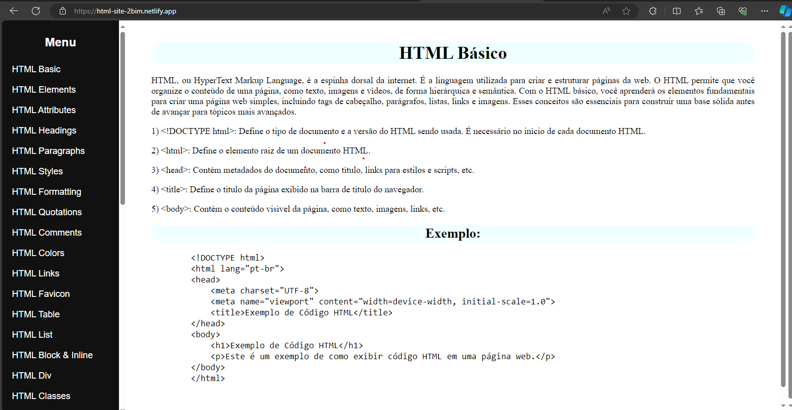
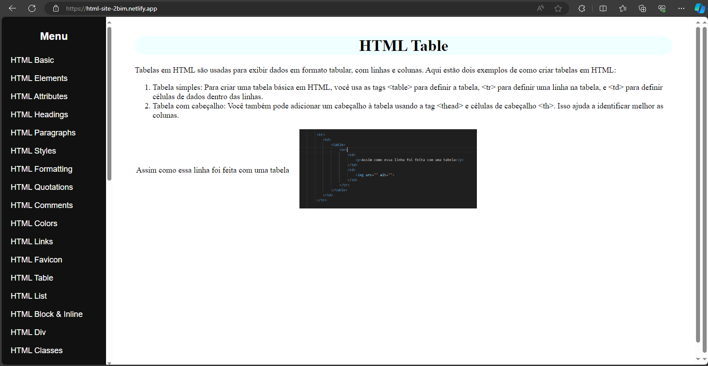
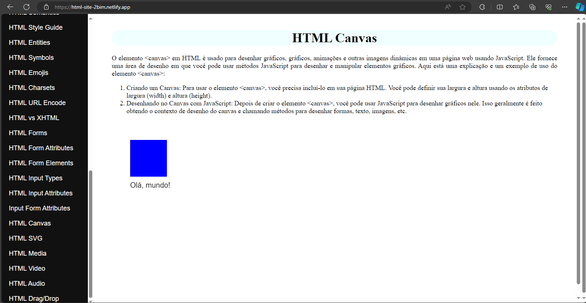

# HTML Site

Esse é um projeto criado em sala de aula, com o intuito de fazer site utilizando HTML5 e CSS3 do Zero para ganhar conhecimento e assim melhorar o desenvolvimento. Ademais, utilizar exemplos de código HTML e HTML implementado na própria página .

## 🚀 Começando

Consulte **[o site](https://html-site-2bim.netlify.app/)** para visualizar o projeto.

### 📋 Pré-Visualização

site:

---
⌨️ com ❤️ por [Ana Laura Lis](https://gist.github.com/oliveirazenith) 😊
